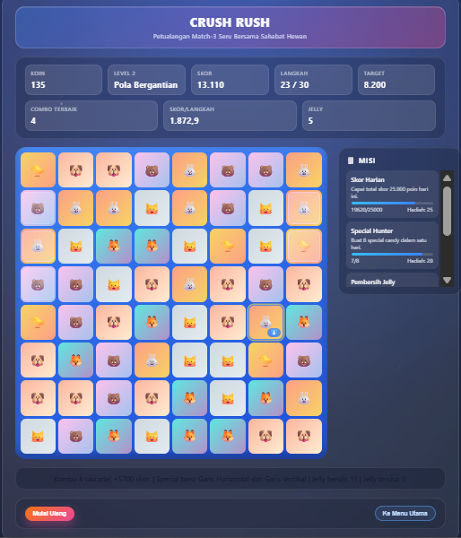

# Crush Rush

Crush Rush adalah prototipe game puzzle match-3 bertema hewan lucu yang dibangun dengan TypeScript dan Vite. Fokus utamanya adalah loop main yang responsif, progres level bertahap, dan sistem misi harian/mingguan berbasis penyimpanan lokal.

## Fitur Utama
- Gameplay match-3 klasik dengan grid dinamis; generator papan memastikan tidak ada deadlock awal.
- Special candy (`line-row`, `line-col`, `bomb`, `block`, `color`) lengkap dengan efek kaskade dan skor kombo.
- Booster in-level seperti Lollipop Hammer dan Free Switch untuk menyelamatkan situasi kritis.
- Target level variatif: skor, jelly multi-layer, dan peti dengan tingkat ketebalan berbeda.
- Sistem skor berbintang, statistik combo tertinggi, dan efisiensi poin per langkah.
- Profil pemain tersimpan di `localStorage`, termasuk progres level, bintang terbaik, dan soft currency.
- Misi harian/mingguan yang dapat diklaim, otomatis reset berdasarkan kalender.
- UI dieksekusi secara imperatif lewat DOM API dengan animasi swap, highlight tutorial, dan ringkasan akhir level.

## Teknologi
- TypeScript 5 untuk logika game yang statically typed.
- Vite 5 sebagai bundler & dev server ber-performa tinggi.
- CSS kustom (`src/styles.css`) untuk styling, tanpa framework UI berat.
- Persistensi berbasis `window.localStorage`.

## Struktur Proyek
- `src/board.ts` – utilitas papan, deteksi match, generator tile, dan resolusi kaskade.
- `src/game.ts` – state mesin game, scoring, kondisi kemenangan/kekalahan.
- `src/levels.ts` – definisi level awal dengan variasi target.
- `src/missions.ts` – definisi misi dasar plus helper reset/progress.
- `src/profile.ts` – manajemen profil pemain & soft currency.
- `src/main.ts` & `src/styles.css` – entri aplikasi dan UI/UX in-game.
- `docs/roadmap.md` – roadmap pengembangan multi-sprint.

## Prasyarat
- Node.js 18 LTS atau lebih baru.
- npm 9+ (bundled bersama Node 18).

## Cara Menjalankan
1. Instal dependensi: `npm install`
2. Jalankan server pengembangan: `npm run dev` lalu buka URL yang ditampilkan (default `http://localhost:5173`).
3. Build produksi: `npm run build`
4. Pratinjau build produksi: `npm run preview`

## Skrip npm
- `npm run dev` – Menjalankan Vite dev server dengan hot reload.
- `npm run build` – Menjalankan `tsc` untuk pengecekan tipe lalu build bundle produksi.
- `npm run preview` – Menyajikan hasil build untuk pemeriksaan lokal.
- `npm run lint` – Menjalankan `tsc --noEmit` untuk memastikan ketepatan tipe.

## Mekanika Permainan
- Tukar dua tile yang berdampingan untuk membuat tiga atau lebih tile sejenis.
- Match 4 atau pola L/T menghasilkan special candy dengan efek garis atau bom, sedangkan match 5 sejenis menghadiahkan Color Bomb.
- Booster dapat dipakai saat permainan: Hammer menghancurkan tile apa pun, sedangkan Free Switch menukar dua tile tanpa mengurangi langkah.
- Jelly dan peti membutuhkan beberapa clear; status target ditampilkan di HUD.
- Habiskan level dengan mencapai target skor dan membersihkan semua rintangan sebelum langkah habis.
- Setelah level selesai, pemain menerima ringkasan skor, bintang, dan progress misi.

## Progress & Misi
- Data profil disimpan secara lokal menggunakan kunci `crush-rush-profile`; hapus storage browser untuk reset.
- Misi menggunakan kunci `crush-rush-missions` dan otomatis reset harian/mingguan berdasarkan waktu perangkat.
- Menyelesaikan level akan menambah soft currency dan dapat membuka level berikutnya jika bintang tercapai.

## Roadmap
Roadmap lengkap setiap tahap pengembangan (pra-produksi sampai live ops) tersedia di `docs/roadmap.md`. Dokumen tersebut memetakan sprint, fitur meta-game, pipeline konten, dan prioritas kualitas.
